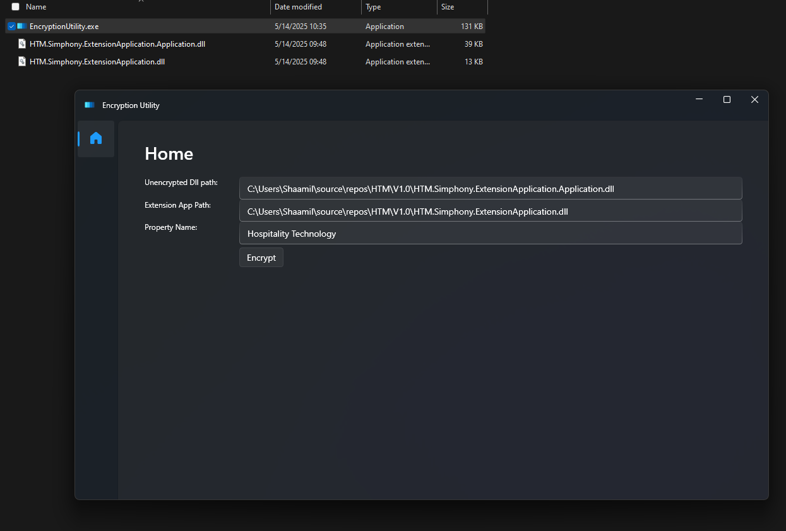
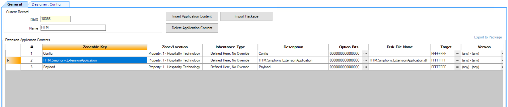
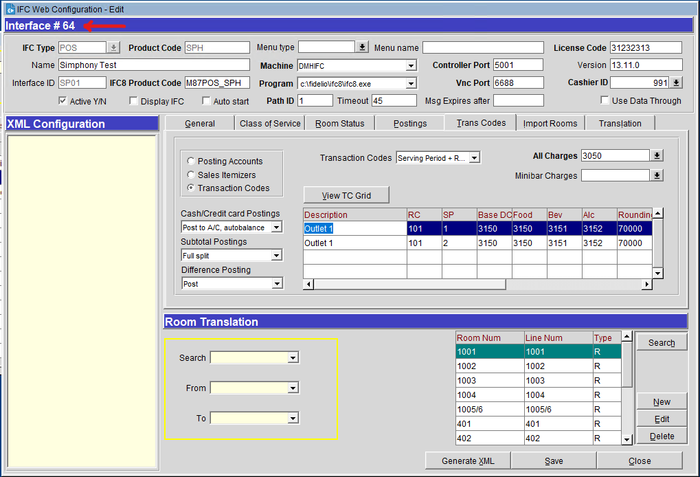
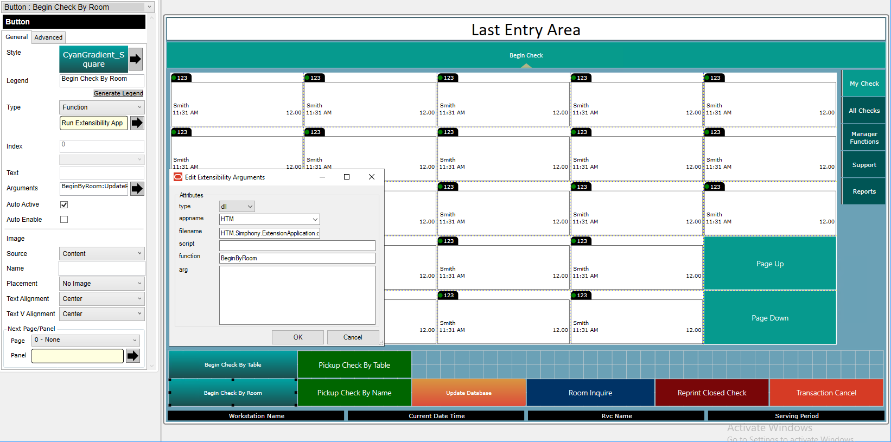

### Prerequisits

Lugman will have the encryption utility that will be used to encrypt the ``HTM.Simphony.ExtensionApplication.Application.dll`` to produce ``Payload`` file.
For each property he will need to run the ``EncryptionUtility.exe``, select values as shown:


After this is done it will produce the Payload file. Then lugman will have to share these two files. ``HTM.Simphony.ExtensionApplication.dll`` and ``Payload``. ``Payload`` file will have not extension. These two files will be used to configure the extension application in Simphony.

### Configuration

Here's an example configuration for the HTM extension application.
You must create extension application with name ``HTM``
Then add the two files provided by Lugman to the extension application as shown.
Then add a new content under ``HTM`` extension application named ``Config``.


The config file must be configured as below:

```
Url = Opera IFC URL (http://OPERASERVERNAME/Operajserv/Ifc8ws/Ifcws)
Username = (if onprem leave this field empty else ask technical team to provide)
Password = (if onprem leave this field empty else ask technical team to provide)
HotelCode = Opera Hotel Code
InterfaceNumber = Opera Interface Number
UseCloudTemplate = 1 if using OperaCloud, 0 if using onprem Opera
AllergyOpenItemObjectNumber = MenuItemNumber for custom allergy entry
OcEntMealPlan = Default Mealplan used for OCENT bills
PadRoomNumberLeftWithZeros = How many digits long the room number must be.
WarnOnGuestDeparture = 1 if enable this feature, 0 if not enabled
ForceDiscountRvcObjectNumbers = Comma seperated list of revenue centers where discount is expected before printing the bill
RolesAllowedToRestartServiceHost = Comma seperated list of role object numbers for roles allowed to restart service host
RvcRangeMultiplier = RvcRangeMultiplier
PropertyRangeStart = PropertyRangeStart
PropertyRangeEnd = PropertyRangeEnd
OcEntUrl = OCENT API URL
OcEntDiscountObjectNumber = OCENT Discount Object Number
```

### Example Config:

```
http://DMHOPERA/Operajserv/Ifc8ws/Ifcws


MVCI
2
0
1102
HB
3
1
1,2,3,4,5,6,7,8,9,10,11,20
101,201
0
0
0
http://192.168.1.42:3000/
4
```

⚠️ Warning:<br/>
Interface Number is not Interface ID.<br/>
Interface number is shown below:



### Page design

In order to use the functions mentioned in the document you must configure the page design button as shown below:

